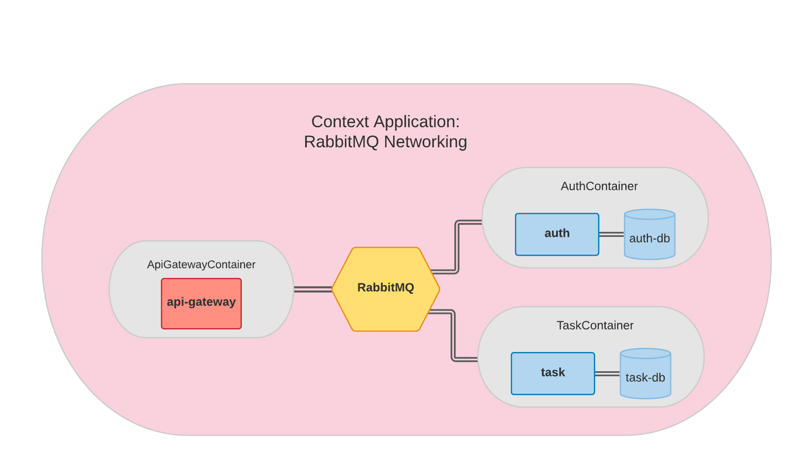

<p align="center">
  <a href="http://nestjs.com/" target="blank"></a>
</p>

# NestJS Microservices with RabbitMQ Exemple

This example is a simple task list application, just with the intention of using the concepts behind <a href="https://docs.nestjs.com/microservices/basics">NestJS with microservices</a>.

## Used Technologies
* Docker
* NodeJS
* MongoDB
* RabbitMQ

## How to run
First of all, you must have <a href="https://docs.docker.com/engine/install/">docker installed</a> on your machine, or <a href="https://nodejs.org/en/download/">nodejs</a> in version >= 16.0.0.

### Locally
To run locally, first of all you have to start RabbitMQ, in this example I am using a docker container with the image.

```bash
docker run -it --rm --name rabbitmq -p 5672:5672 -p 15672:15672 -e RABBITMQ_DEFAULT_USER=admin -e RABBITMQ_DEFAULT_PASS=admin  rabbitmq:3.9-management
```

The `RABBITMQ_DEFAULT_USER` and `RABBITMQ_DEFAULT_PAS` arguments are for asserting which credentials the RabbitMQ preview pane will be accessed with. To access the preview pane, just go in `http://localhost:15672` 

After running the RabbitMQ image, just go into each directory, install the dependencies and run each service. For example:


### Api Gateway
```bash
$ cd ./api-gateway
$ yarn
$ yarn start:debug
```
or using npm

```bash
$ cd ./api-gateway
$ npm install
$ npm run start:debug
```

### Auth
```bash
$ cd ./auth
$ yarn
$ yarn start:debug
```
or using npm

```bash
$ cd ./auth
$ npm install
$ npm run start:debug
```

### Task
```bash
$ cd ./task
$ yarn
$ yarn start:debug
```
or using npm

```bash
$ cd ./task
$ npm install
$ npm run start:debug
```

## Docker
To run using docker container

### RabbitMQ
First you need to run the RabbitMQ image as docker-compose so that your network is shared by everyone.

```bash
$ cd ./infra/rmq
$ docker-compose up
```

After that, just go into each directory and run docker-compose up. For example:

### Api Gateway

```bash
$ cd ./api-gateway
$ yarn #or npm install
$ docker-compose up dev
```

### Auth

```bash
$ cd ./auth
$ yarn #or npm install
$ docker-compose up mongodb
$ docker-compose up dev
```

### Task

```bash
$ cd ./task
$ yarn #or npm install
$ docker-compose up taskdb
$ docker-compose up dev
```

## Overview

<p align="center">
  
</p>

## Front end in future!